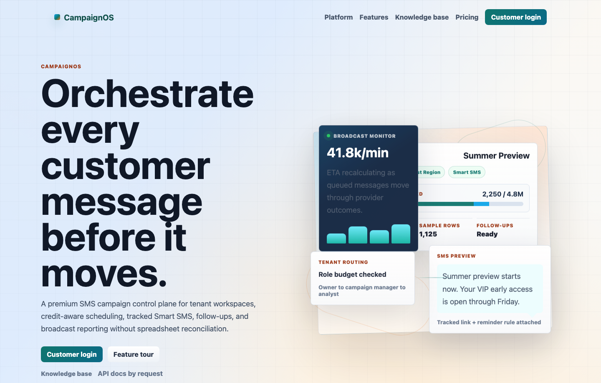

# CampaignOS Distributed Campaign Platform

CampaignOS is a local-first, EKS-ready campaign delivery simulator for showing
distributed workflows, GitOps, autoscaling, distributed tracing, open-source
observability, SLOs, and incident runbooks.

Public UI preview: <https://distributed-campaign-platform.bozhi.dev>
Runtime preview: request-only through <https://bozhi.dev/#request>



> Status: Portfolio demo slice: local-first multi-tenant SMS workflows, admin health, content templates, analytics, CI scans, and static-host guardrails are covered by targeted UI/API tests.

## Development note

This project was built with AI-assisted coding support. Product direction,
architecture, validation, deployment choices, operations, and maintenance remain
my responsibility.

## Public status

| Surface | Status | Notes |
| --- | --- | --- |
| Static CampaignOS UI | Public static host | `distributed-campaign-platform.bozhi.dev` serves the product UI shell, deep links, and static route guardrails. |
| Local runtime | Build validated | Docker Compose, API tests, UI tests, Helm render checks, and image scans cover the service slice. |
| Observability | Local and approved preview | OpenTelemetry, Prometheus, Grafana, Loki, Tempo, alerts, and runbooks are prepared for local or approved preview validation. |
| EKS runtime preview | Request-only | Shared EKS demos are short-lived validation windows, not always-on campaign infrastructure. |
| ECR image publish | Manual-only | CI builds and scans images automatically; pushing AWS image artifacts requires a manual workflow dispatch. |

## Goals

CampaignOS focuses on domain-relevant distributed-system and platform engineering work:

- AWS EKS platform design and operation
- Terraform-managed AWS infrastructure
- Kubernetes workloads, Helm packaging, and GitOps delivery
- Open-source observability with OpenTelemetry, Prometheus, Grafana, Loki, Tempo, and Alertmanager
- Autoscaling, backpressure, SLOs, incident scenarios, and runbooks
- Kubernetes and AWS security controls such as IRSA, RBAC, NetworkPolicies, and policy-as-code
- Cost-aware cloud design with local-first development and ephemeral EKS environments

## Application concept

CampaignOS simulates a distributed campaign delivery platform:

```text
Campaign API → Segment Worker → Scheduler → Dispatch Queue → Dispatchers → Provider Simulator
                                      ↓                                ↓
                                PostgreSQL/Redis ← Webhook Receiver ← Provider callbacks
                                      ↓
                                  Status API
```

Core distributed-systems behaviors:

- campaign fan-out into recipient/message jobs
- asynchronous queue/stream processing
- provider rate limits and partial failures
- retries, jitter, and dead-letter handling
- idempotency for dispatch and webhook callbacks
- backpressure from queue depth and provider quotas
- structured logs, metrics, traces, and correlation IDs

## Implemented and Preview Stack

| Layer | Tools |
|---|---|
| Cloud | S3/CloudFront static host, ECR image path, and request-only AWS EKS preview scaffolding |
| IaC | Terraform |
| Kubernetes | Helm, HPA, PDBs, NetworkPolicies, Argo CD scaffolding, optional Karpenter expansion |
| App | Python 3.12, FastAPI, async workers |
| Data and queueing | PostgreSQL, Redis, NATS JetStream locally, optional SQS for AWS-native EKS dispatch |
| Observability | OpenTelemetry Collector, Prometheus, Grafana, Loki, Tempo, Alertmanager |
| Security | IRSA, RBAC, NetworkPolicies, Trivy, Gitleaks, optional External Secrets and Kyverno expansion |
| Testing | pytest, k6, Helm lint, Terraform validation |

## Repository layout

```text
apps/                  Application services and shared libraries
deploy/helm/           Helm charts for app/platform deployment
docs/                  Architecture, decisions, runbooks, cost, security, plans
infra/terraform/       AWS infrastructure modules and environments
platform/              Argo CD apps, observability values, policies, secrets integration
tests/load/            k6 load tests and incident simulations
scripts/               Bootstrap, local dev, validation, teardown helpers
```

## Documentation

- [Product doc](docs/product/sms-saas-product-doc.md)
- [Architecture](docs/architecture/architecture.md)
- [Implementation status](docs/architecture/implementation-status.md)
- [Architecture diagram](docs/architecture/architecture-diagram.mmd)
- [AWS EKS architecture diagram](docs/architecture/aws-eks-architecture.mmd)
- [Local demo runbook](docs/runbooks/local-demo.md)
- [EKS dev deployment runbook](docs/runbooks/eks-dev.md)
- [Observability runbook](docs/runbooks/observability.md)
- [Customer user guide](docs/kb/customer-user-guide.md)
- [Internal admin guide](docs/kb/internal-admin-guide.md)
- [Privacy note](docs/privacy.md)

## CI and Security

- CI runs Python tests, public-readiness checks, workflow-contract checks,
  React tests/build, static edge-router validation, Helm render checks, Docker
  image builds, and Trivy image scans.
- Dedicated dependency audits run `pip-audit` from the uv lock export and
  `npm audit` for the web UI.
- Security workflows run Gitleaks, blocking Trivy filesystem vulnerability/secret
  scans, blocking image scans, CodeQL source analysis, and Dependency Review for
  public pull requests. Trivy IaC/Kubernetes misconfiguration scanning stays
  advisory until production promotion because this repo includes local demo
  infrastructure and EKS scaffolding.
- Scheduled static-host smoke covers HTTP guardrails and Chromium browser
  rendering on selected deep links, including console, overflow,
  visitor-telemetry, privacy-signal, and serious/critical accessibility checks.
- Dependabot tracks GitHub Actions, uv, npm, Dockerfiles, and Terraform so
  security fixes turn into reviewable pull requests instead of manual drift.

## Development modes

1. **Local app mode**: Docker Compose for PostgreSQL, Redis, NATS, and services.
2. **Local Kubernetes mode**: kind + Helm to validate Kubernetes manifests without AWS cost.
3. **Ephemeral EKS mode**: Terraform and Helm are prepared for approved EKS integration tests and screenshots, then immediate destroy.

## Local Docker Compose end-to-end smoke test

The local Compose stack runs PostgreSQL, Redis, NATS JetStream, Campaign API, Provider Simulator, and Dispatcher with host ports bound to loopback only:

- Campaign API: <http://127.0.0.1:8081>
- Web UI: <http://127.0.0.1:8080>
- Provider Simulator: <http://127.0.0.1:8082>
- Dispatcher health app: <http://127.0.0.1:8083>

Each app exposes:

- `/healthz` for liveness
- `/readyz` for Kubernetes readiness
- `/metrics` for Prometheus-format service metadata

Run the stack and smoke test:

```bash
docker compose up --build -d
scripts/local/e2e-smoke-test.sh
```

The smoke test waits for the local dependencies and service health endpoints, creates a campaign through the Campaign API, then polls `GET /campaigns/{id}` until every message has left `queued` and reached a terminal status (`sent`, `failed`, or `dead_lettered`). Compose defaults the provider simulator to `PROVIDER_MODE=success`, so the deterministic expected result is `sent == message_count`.

The browser demo UI is served by Nginx and proxies API calls under `/api/*` to the Campaign API, so `http://127.0.0.1:8080` can create campaigns and poll status without CORS configuration. The frontend keeps the API base local-first through `window.__APP_CONFIG__?.apiBaseUrl ?? import.meta.env.VITE_API_BASE_URL ?? "/api"`.

The static portfolio host uses the same React build without an always-on API.

### Demo Auth Boundary

This repo uses local/demo identity signals such as access codes, `X-Company-Id`, stored browser session company ids, and `X-Internal-Admin: true`. Those are deliberate simulator controls for local review, not production authentication. A production version would replace them with an IdP-backed session, tenant-aware RBAC, signed provider webhooks, audited admin roles, and rate-limited public endpoints.
Its CloudFront edge router must reject `/api/*` and `/r/*` unless those paths
are explicitly proxied to a provisioned demo stack; otherwise static hosting can
serve the app shell where JSON is expected.

Dispatcher reliability defaults:

- transient provider statuses `429`, `500`, `502`, `503`, and `504` are retried
- retries are published to `messages.dispatch.retry`
- exhausted messages are published to `messages.dispatch.dead_letter`
- `DISPATCHER_MAX_ATTEMPTS` defaults to `3`

Useful overrides:

```bash
# Allow more time on slow machines.
TIMEOUT_SECONDS=120 scripts/local/e2e-smoke-test.sh

# Exercise non-success provider outcomes.
PROVIDER_MODE=rate_limit docker compose up --build -d
EXPECT_SENT_ALL=false scripts/local/e2e-smoke-test.sh
```

To stop the local stack:

```bash
docker compose down
```

## Demo Retail Co seed data

After the local database is running, seed a richer SMS SaaS demo tenant:

```bash
. .venv/bin/activate
python scripts/local/seed-demo-data.py
```

The script is rerunnable and prints the Demo Retail Co customer email, access code, and company id. It populates regional lists, 12 subscribers, realistic media assets, and scheduled campaigns.

Demo flow after seeding:

1. Open the web UI and use the internal surface to log in as an admin.
2. Review Companies, then use Review on Demo Retail Co to inspect subscribers, campaigns, scheduled reach, credits, quota usage, access code, and recent/upcoming campaigns.
3. Open the customer app with the seeded customer access code, then use Content Library templates to prefill Campaign Builder with copy, Smart SMS type, and matching media where available.
4. Review Company Analytics for scheduled reach, campaign count, message volume, subscriber lists, clicks/redemptions, and campaign summary rows.
5. Review Internal Usage for top tenant, scheduled reach, quota usage, and company health.

## Local kind + Helm validation

Render and lint the Kubernetes chart without touching AWS:

```bash
helm lint deploy/helm/campaign-platform
helm template campaign-platform deploy/helm/campaign-platform >/tmp/campaign-platform-rendered.yaml
```

Deploy to a local kind cluster:

```bash
scripts/local/kind-deploy.sh
```

The kind path builds local images, loads them into kind, installs the Helm chart, and waits for the four app deployments to roll out.

Access the web UI in kind:

```bash
kubectl -n campaign-platform port-forward svc/campaign-platform-web-ui 18080:80
open http://127.0.0.1:18080
```

## Observability stack scaffolding

Open-source observability Helm values live in:

```text
platform/observability
```

The scaffold covers Prometheus/Alertmanager/Grafana, Loki, Tempo, and OpenTelemetry Collector values. The app chart can emit `ServiceMonitor` resources when the Prometheus Operator CRDs are installed.

See [`platform/observability/README.md`](platform/observability/README.md) for install commands.

## Runtime Preview Boundary

The public static host is the always-available review surface. The fuller runtime path is request-only and intended for short approved windows, where Terraform, ECR image repositories, Helm EKS values, ingress, External Secrets wiring, persistent demo data services, readiness checks, and observability can be validated together.

Use [`docs/runbooks/eks-dev.md`](docs/runbooks/eks-dev.md) for the ephemeral cloud deployment flow. Any approved cloud run should record the application smoke result, observability check, and cleanup result before the stack is destroyed.
